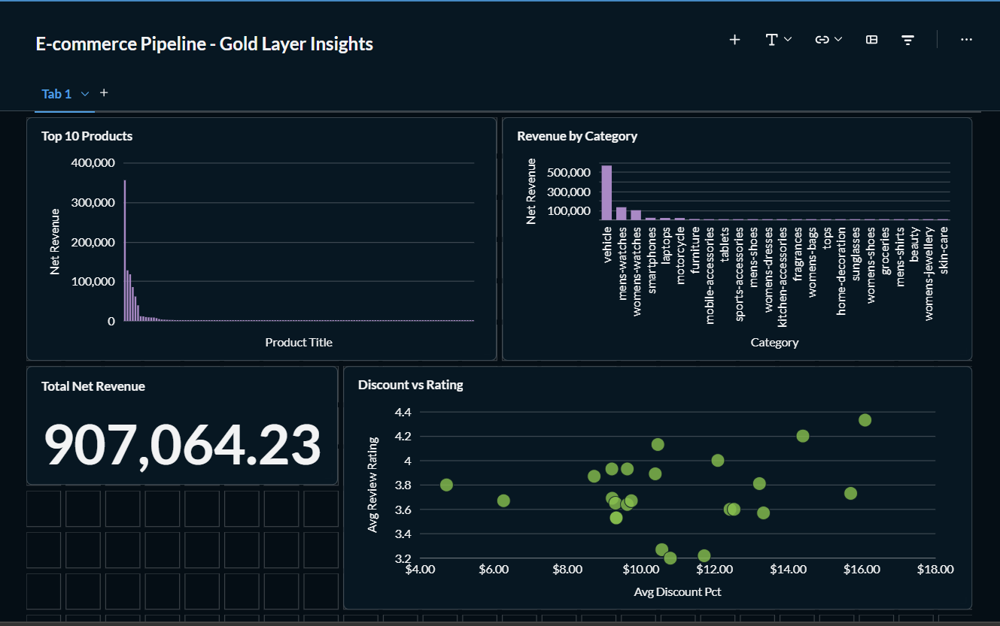

# E-commerce Data Pipeline

A production-grade end-to-end data engineering pipeline built on real-world tools and patterns used by data teams at scale.

**Live data source:** [DummyJSON](https://dummyjson.com) — products, carts, users  
**Stack:** Python · DuckDB · dbt · Apache Airflow · Metabase · Docker

---

## Architecture
```
DummyJSON API
     │
     ▼
┌─────────────┐
│   Extract   │  Python + requests — paginated API ingestion
│  (Python)   │  194 products · 50 carts · 208 users
└──────┬──────┘
       │
       ▼
┌─────────────┐
│   Bronze    │  Raw layer — DuckDB
│  (DuckDB)   │  Unmodified JSON, timestamped, append-only
│             │  products_raw · carts_raw · users_raw
└──────┬──────┘
       │
       ▼
┌─────────────┐
│   Silver    │  Clean layer — dbt
│   (dbt)     │  Deduped · nulls handled · types enforced
│             │  dim_products · dim_users · fct_carts
│             │  fct_cart_items · product_reviews
└──────┬──────┘
       │
       ▼
┌─────────────┐
│    Gold     │  Business layer — dbt
│   (dbt)     │  daily_revenue · top_products
│             │  category_performance
└──────┬──────┘
       │
       ▼
┌─────────────┐
│  Metabase   │  Business dashboards
│ (Dashboard) │  Revenue · Products · Categories
└─────────────┘

Orchestration: Apache Airflow (Docker) — daily at 6 AM
Monitoring:    Row count checks · anomaly detection · run logging
Data Quality:  38 dbt tests — unique · not_null · accepted_values · custom SQL
```

---

## Dashboard



**Key metrics surfaced:**
- $907K net revenue across 50 orders
- Vehicles drive 62.7% of revenue from just 5 products
- 9.68% average discount rate across all categories
- Skin-care has highest avg rating (4.33) but near-zero revenue — a marketing opportunity

---

## Tech Stack

| Layer | Tool | Purpose |
|---|---|---|
| Ingestion | Python + requests | Paginated API extraction |
| Storage | DuckDB | Local cloud-warehouse substitute |
| Transformation | dbt Core | SQL models, testing, documentation |
| Orchestration | Apache Airflow | DAG scheduling and monitoring |
| Visualisation | Metabase | Business dashboards |
| Containerisation | Docker | Reproducible Airflow + Metabase setup |
| Version control | Git + GitHub | Full project history |

---

## Project Structure
```
ecommerce-pipeline/
├── ingestion/
│   ├── extract.py          # Paginated API extraction
│   ├── load.py             # DuckDB Bronze loader
│   ├── pipeline.py         # Entrypoint — extract + load + monitor
│   ├── monitoring.py       # Run logging, anomaly detection
│   └── export_gold.py      # CSV export for Metabase
│
├── dbt_project/
│   └── ecommerce_dbt/
│       ├── models/
│       │   ├── silver/     # 5 cleaning models
│       │   └── gold/       # 3 business models
│       ├── tests/          # 6 custom SQL data quality tests
│       └── macros/         # generate_schema_name override
│
├── airflow/
│   ├── dags/
│   │   └── ecommerce_pipeline.py   # 6-task orchestration DAG
│   └── docker-compose.yml
│
├── dashboard/
│   └── screenshots/        # Metabase dashboard evidence
│
├── data/
│   ├── raw/                # Timestamped JSON extracts
│   └── exports/            # CSV exports for Metabase
│
└── docs/
    └── architecture.png
```

---

## Data Model

### Bronze — Raw tables (3 tables)
Stores API responses exactly as received. Nested JSON preserved as strings. Every row timestamped with `_ingested_at`. Never modified after load.

### Silver — Cleaned tables (5 tables)

| Table | Description |
|---|---|
| `dim_products` | 194 products, dimensions flattened, discounted price derived |
| `dim_users` | 208 users, address/company/hair flattened, PII excluded |
| `fct_carts` | 50 carts, savings amount and savings % derived |
| `fct_cart_items` | 198 line items, exploded from nested products array |
| `product_reviews` | Reviews exploded from products, one row per review |

### Gold — Business tables (3 tables)

| Table | Description |
|---|---|
| `daily_revenue` | Daily KPIs: gross/net revenue, discount rate, avg order value |
| `top_products` | Revenue, volume, rating per product — joined across Silver |
| `category_performance` | Category-level aggregation with revenue share % |

---

## Data Quality

38 automated tests run after every pipeline execution:

- **Uniqueness** — primary keys across all Silver and Gold tables
- **Not null** — critical fields: price, product_id, email, cart_id
- **Accepted values** — availability_status, gender, review ratings
- **Custom SQL tests:**
  - Discounted price must be ≤ original price
  - Cart totals must be positive
  - Discounted total must be ≤ gross total
  - Line total must match price × quantity (within 1% tolerance)
  - Gold revenue must never be negative
  - Review ratings must be between 1 and 5

---

## Airflow DAG

Six tasks run in sequence daily at 6 AM:
```
extract_from_api
      │
load_to_bronze
      │
dbt_run_silver
      │
dbt_run_gold
      │
dbt_test (38 tests)
      │
pipeline_health_check
      │
monitoring_checks
```

Features: auto-retry (2x, 3-min delay), XCom for inter-task data passing, health check raises exception on row count violations.

---

## Monitoring

Every pipeline run logs to `monitoring.pipeline_runs`:
- Run ID, start/end time, duration
- Row counts per entity (products, carts, users)
- Pass/fail status and error message

Row count anomaly detection flags tables where:
- Count drops more than 20% from previous run
- Count falls below minimum expected threshold

Data freshness check alerts when Bronze tables are older than 25 hours.

---

## How to Run

### Prerequisites
- Python 3.11+
- Docker Desktop
- Git

### Setup
```bash
git clone https://github.com/YOUR_USERNAME/ecommerce-pipeline.git
cd ecommerce-pipeline

python -m venv venv
source venv/bin/activate  # Windows: venv\Scripts\activate
pip install -r requirements.txt
```

### Run the pipeline locally
```bash
python ingestion/pipeline.py
```

### Run dbt transformations
```bash
cd dbt_project/ecommerce_dbt
dbt run
dbt test
```

### Start Airflow + Metabase
```bash
cd airflow
docker-compose up -d
```

- Airflow UI: http://localhost:8080 (admin / admin)
- Metabase: http://localhost:3000

### View monitoring report
```bash
python ingestion/pipeline.py
# Monitoring report prints at end of every run
```

---

## Key Engineering Decisions

**Why DuckDB instead of Postgres?**
DuckDB runs in-process with no server setup, making the project fully portable. The SQL dialect is nearly identical to Snowflake — swapping the dbt adapter is a one-line change when deploying to production.

**Why dbt for transformations instead of pandas?**
dbt makes transformations version-controlled, testable, and documented. Every model is a SELECT statement — reviewable, diffable, and deployable without touching application code.

**Why the Medallion architecture (Bronze/Silver/Gold)?**
Separating raw, cleaned, and business layers means failures are isolated. If a Silver model breaks, Bronze is untouched. You can re-derive everything downstream without re-hitting the API.

**Why store nested JSON as strings in Bronze?**
Bronze is a landing zone, not a database. Flattening at ingestion time loses information and creates coupling to the source schema. Flattening in Silver (dbt) means the logic is testable, documented, and rerunnable.

**Why drop PII in Silver instead of Bronze?**
Bronze is your audit trail — complete and immutable. Silver is what analysts and downstream consumers access. Dropping SSN/EIN/bank data at the Silver boundary enforces access control at the right layer.

---

## What I'd add with more time

- Snowflake as the production data warehouse (swap is one dbt profile change)
- Great Expectations for advanced data quality profiling
- Slack alerting on pipeline failures via Airflow callbacks
- CI/CD pipeline (GitHub Actions) running `dbt test` on every PR
- Incremental dbt models for efficiency at scale
- DBT documentation site (`dbt docs generate && dbt docs serve`)

---

## Author

**Sarthak Mahale**  
Data Engineering Portfolio Project  
[LinkedIn](https://www.linkedin.com/in/sarthak-mahale-626635267/) · [GitHub](https://github.com/sarthakmahale123)